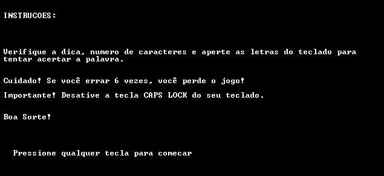
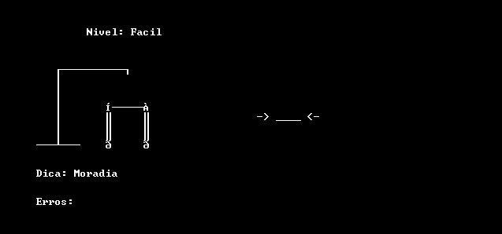
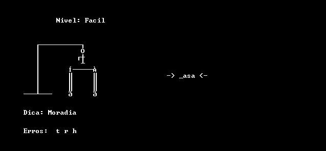
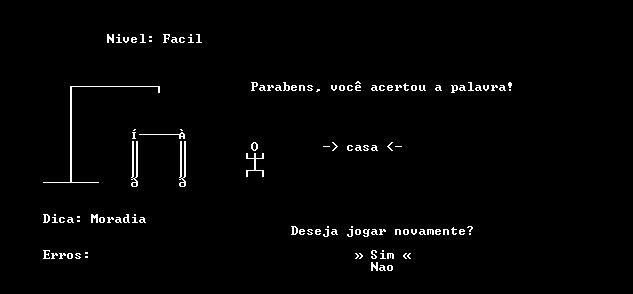
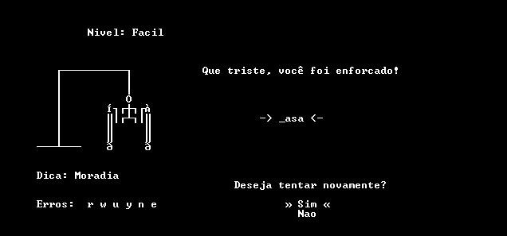

# SUPER SENAI FORCA

Super Senai Forca é o tradicional jogo da forca, onde você deve tentar adivinhar as letras que formam uma palavra qualquer e caso erre algumas vezes, você será enforcado.

Após a apresentação do jogo, você terá quatro opções:

**Fácil**: Inicia o jogo no modo fácil, com palavras simples e dicas óbvias.

**Médio**: Como o nome sugere, inicia o jogo no modo médio. Você terá de descobrir palavras simples, porém com dicas não tão óbvias.

**Difícil**: Você terá um grande desafio. Com palavras pouco usadas no nosso vocabulário e dicas discretas, você provavelmente vai se deparar com palavras antes nunca vistas ou ouvidas.

**Sair**: Você sai do jogo.

Após escolher algum modo de jogo, você se estará em uma tela contendo instruções:

Iniciando o jogo:

Na parte superior esquerda, você verá Nível, indicando a dificuldade atual do jogo.
No centro a esquerda você verá o desenho da forca, onde mostra quão perto de ser enforcado você está.
Na parte inferior direita você verá a Dica da palavra a ser descoberta.
E logo abaixo Erros, que mostrará todas as teclas que você pressionou que não fazem parte da palavra.
Na parte central você verá o diagrama da palavra, que constará todas as letras que você acertar.

Jogando:

Você irá apertar as letras do teclado e caso acerte elas irão aparecendo no diagrama. Letras repetidas aparecerão todas de um vez.

Ganhando:

Se você conseguir acertar a palavra com menos de seis erros, parabéns, você foi livrado da forca.

Após ganhar você terá a opção de jogar novamente, caso escolha sim, retornará para a tela de selecionar a dificuldade, caso escolha não, você sairá do jogo.

Perdendo:

Caso você erre seis vezes, você será enforcado.

Após isso, você poderá escolher em continuar jogando ou sair do jogo, escolha sim para retornar ao menu de modos ou não para sair do jogo.

## Conclusão:

Utilizando a maioria dos conteúdos vistos em aula, Super Senai Forca, apesar de sua interface aparente simples, exigiu muitos cuidados com possíveis erros que poderiam acontecer, como a contagem de pontos que não poderia ser feita quando pressionada uma tecla correta, pois só poderias contar uma vez e ao repeti-la algumas vezes você ganharia facilmente o jogo. No geral, foi um jogo fácil de desenvolver, utilizando dentro da linguagem C uma lógica simples e inspiração em vários jogos e aplicativos conhecidos como apresentações e menus facilmente operáveis. 
E que venha o C++.